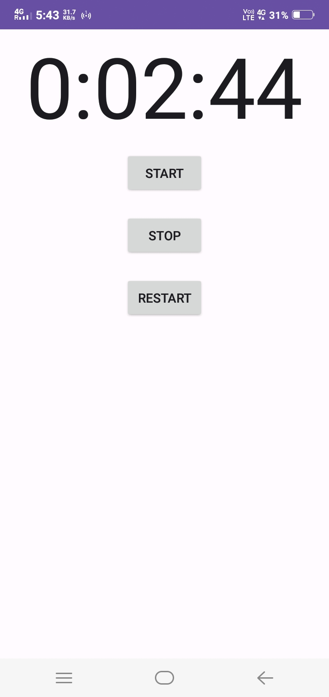
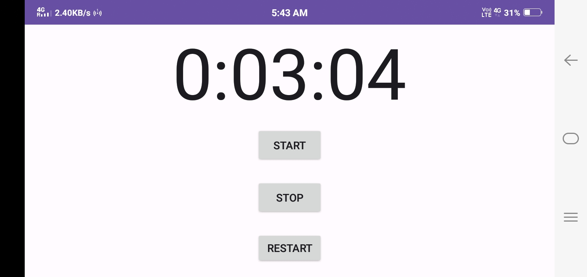

# ⏱️ Tracktime ⏰

**Tracktime** is an Android application built with **Java** that helps users track time spent on various tasks. The app utilizes **Handler** to manage timing operations and handles **screen rotations** by saving the state, ensuring a seamless user experience even when the app is restarted or rotated.

With **Tracktime**, users can start, stop, and reset timers to track time spent on activities, making it perfect for personal productivity and task management.

### 🛠️ Technologies & Tools
- **Language**: Java
- **Handler**: Used for managing time operations.
- **Activity Lifecycle**: Manages state during screen rotations, saving and restoring timer state.

### 📦 APK Download
Download and try the latest version of **Tracktime** here:
[Download TrackTime APK](https://github.com/Vanshi17/TrackTime/raw/master/Screenshots/TrackTime.apk)

### 📸 Screenshots

        

### 🚀 Features
- **Timer Functionality**: Start, stop, and reset timers to track time spent on various tasks.
- **Screen Rotation Handling**: The app saves and restores the timer state when the screen is rotated or the app is reopened.
- **Activity Lifecycle**: Efficiently manages activity lifecycle to ensure a seamless user experience.
- **Simple UI**: A clean, easy-to-use interface for tracking time.

